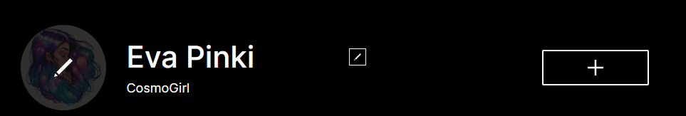
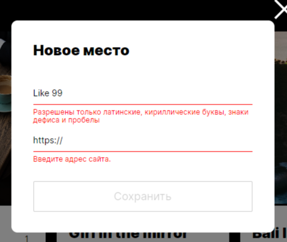

# Проект "Mesto"

Добро пожаловать в проект "Mesto"! Это интерактивная страница, где вы можете делиться своими любимыми картинками. Вы можете добавлять новые карточки с картинками, удалять их, ставить лайки другим карточкам, а также просматривать карточки других пользователей.

[Посмотреть сайт](https://pollisun.github.io/mesto-project-ff/)

## Описание проекта

Основной функционал проекта "Mesto":

- Добавление новых карточек 
- Удаление карточек
- Просмотр карточек других пользователей
- Постановка и снятие лайков карточкам
- Редактирование личного профиля

## Технологии

Проект реализован с использованием следующих технологий:

- HTML5
- CSS3
- JavaScript 
- Webpack
- API запросы к серверу

## Структура проекта

В проекте реализована сборка Webpack в трех вариантах:

- **build** - для сборки проекта
- **dev** - для локальной разработки и просмотра
- **deploy** - для итоговой выгрузки на хостинг

## Уникальные составляющие проекта
Уникальная особенность проекта "Mesto" заключается в его интерактивной и динамической природе. Пользователи могут взаимодействовать с карточками, добавлять свои и наслаждаться.

Формы на сайте проходят валидацию на клиентской стороне перед отправкой данных на сервер. Это позволяет убедиться, что введенные пользователем данные соответствуют определенным критериям.

Сайт взаимодействует с сервером посредством API запросов. Это может включать запросы на получение данных, добавление новых элементов, удаление или обновление существующих.

## Автор

Автор проекта - **Lepekhina Polina**.

## Благодарность

Выражаю благодарность **Яндекс Практикуму** за предоставление дизайна и теории.

Ссылка на репозиторий:
git@github.com:PolliSun/mesto-project-ff.git
https://github.com/PolliSun/mesto-project-ff.git
