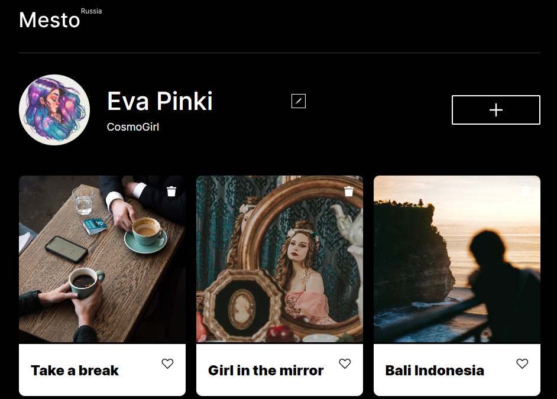
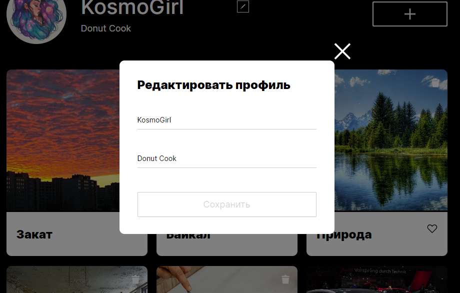
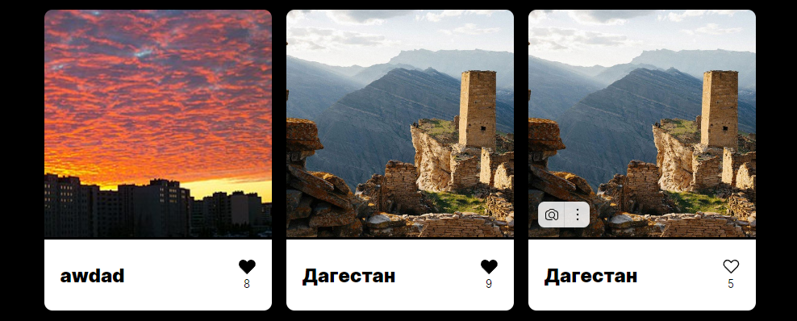
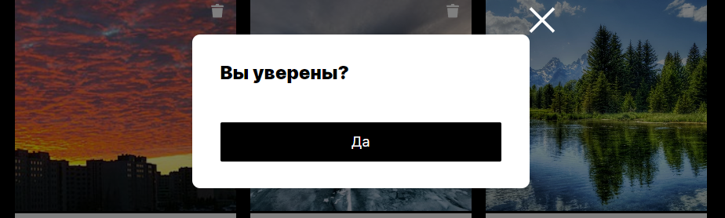

# Проектная работа "Mesto"

[Посмотреть сайт](https://pollisun.github.io/mesto-project-ff/)

## Описание 

Это проект представляет собой интерактивную страницу для публикации фотографий и краткой информации о них. Пользователь может редактировать профиль, добавлять новые карточки с изображениями и названиями, ставить лайки понравившимся карточкам и удалять их. 



## Стек

- **HTML5**
- **CSS3**
- **JavaScript**
- **Webpack**
- **API** запросы к серверу

## Структура проекта

- `src/ `— исходные файлы проекта.
- `src/components/` — папка с JS компонентами.
- `src/index.html` — HTML-файл главной страницы.
- `src/index.js` —  папка с основным кодом.
- `src/pages/index.css` —  папка с основным кодом CSS.

- `src/components/api.js` — файл для API запросов к серверу.
- `src/components/card.js` — файл для работы карточек удаление, добавление и постановка лайка.
- `src/components/modal.js` — файл для работы модальных окон открытие, закрытие.
- `src/components/validation.js` — файл для работы валидации формы.
- `src/utils/utils.js` —  файл с утилитами.
- `src/utils/constants.ts` — файл с константами.

## Инструкция по запуску

1. Скачайте или клонируйте репозиторий.
2. Выполните команды в терминале
```
npm install
npm run dev
```

В проекте имеется сборка Webpack в трех вариантах:
- **build** - для сборки проекта
- **dev** - для локальной разработки и просмотра
- **deploy** - для итоговой выгрузки на хостинг

#### Ссылка на репозиторий:
```https://github.com/PolliSun/mesto-project-ff.git```

## Реализованный функционал

- При загрузке страницы отображаются карточки, загружаемые с сервера, а также данные текущего пользователя. Интеграция реализована через API.
- Возможность добавления новой карточки осуществляется через форму, где данные отправляются на сервер, а карточка добавляется в начало списка.
- Возможность удалять карточки, созданные пользователями. На карточках, созданных другими пользователями, кнопка удаления отсутствует.
- Возможность ставить и снимать лайки. Количество лайков отображается в реальном времени.
- Работа с попапами включает формы редактирования профиля, добавления карточек и просмотра изображения в полном размере. 
- При редактировании профиля форма заполняется актуальными данными, которые обновляются на сервере после подтверждения.
- Валидация форм предотвращает отправку некорректной информации, настроена по строгим правилам, с проверкой длины текста, структуры `URL` и кастомными сообщениями об ошибках.

## Что сделано

- Начальные карточки загружаются через **GET**-запрос, массив данных обрабатывается и отображается на странице. Для загрузки карточек и информации о пользователе используется `Promise.all`.
- Написаны обработчики открытия и закрытия попапов, включая обработку нажатия на оверлей и клавишу `Esc`. Обработчики добавляются при открытии окна и удаляются при закрытии для оптимизации. Внедрены CSS-анимации для плавного появления и исчезновения попапов. Использована прозрачность для создания эффекта плавного перехода. 
 
- Добавлен функционал для заполнения полей формы текущими данными и обновления страницы после редактирования. Реализован обработчик события `submit`, который обновляет информацию на сервере через **PATCH**-запрос с передачей новых значений. 
 
- При отправке формы новая карточка создаётся и добавляется в начало контейнера. Попап автоматически закрывается, а введённые данные очищаются. Новая карточка создаётся через **POST**-запрос с передачей имени и ссылки.
- Написана функция лайка, которая изменяет состояние и стиль кнопки при клике. Состояние лайков синхронизируется с сервером через **PUT**/**DELETE**-запросы. Каждая карточка отображает текущее количество лайков, используя массив `likes`.

- Добавлена проверка, чтобы корзина отображалась только на карточках, созданных пользователем. Удаление синхронизируется с сервером через **DELETE**-запрос с идентификатором карточки. После подтверждения действия карточка удаляется с экрана и сервера.

- Добавлена проверка обязательных полей, длины названия и формата URL для ссылки на изображение. Ошибки отображаются под полями, а кнопка отправки блокируется при не валидных данных. Ошибки очищаются при повторном открытии попапа. 
- 

## Благодарность

Выражаю благодарность **Яндекс Практикуму** за предоставление дизайна и теории.
